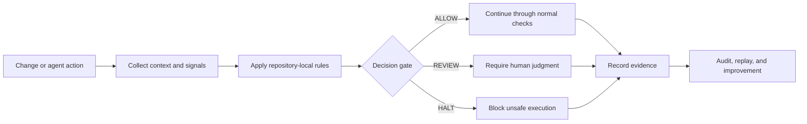

# AI Governance for Developer Tooling

## Positioning

I design governed AI and developer workflows that turn ambiguous automation into controlled, inspectable execution. The focus is practical: deterministic routing, explicit permissions, evidence before enforcement, audit-ready records, and clear human-review boundaries.

This brief consolidates existing portfolio evidence. It does not combine the underlying projects into one product, change their ownership boundaries, or claim production readiness beyond published validation.

## Capability map

| Capability | Existing artifact | What the evidence supports |
|---|---|---|
| Pull-request risk routing | [DiffWall](https://github.com/dburt-proex/diffwall) | Repository-local rules can classify controlled changes into `REVIEW` and `HALT` paths. |
| Evidence before enforcement | [DiffWall live validation](https://github.com/dburt-proex/diffwall/blob/main/docs/live-validation-case-study.md) | Reports, PR comments, and workflow artifacts were published before a destructive change was blocked. |
| Deterministic scoring | [VIL deterministic scoring engine](https://github.com/dburt-proex/VIL_deterministic_scoring_engine) | Public project work focused on structured signal scoring and governed decision logic. Implementation maturity should be assessed from the repository's current tests and documentation. |
| Workflow governance patterns | [Governance Harness Toolkit](https://github.com/dburt-proex/governance-harness-toolkit) | Public project work focused on reusable governance contracts, workflow controls, evidence requirements, and operating patterns. |
| Governance assessment | [Operator Intelligence](https://github.com/dburt-proex/operator-intelligence) | Public project work focused on evaluating governance readiness, findings, scoring, and implementation priorities. |
| Instruction control | [PromptBP](https://github.com/dburt-proex/PromptBP) | Public project work focused on structured instructions, output contracts, anti-drift rules, and repeatable execution patterns. |

## Governed development lifecycle

## Verified implementation proof

DiffWall was validated through two controlled GitHub pull-request workflows on July 11, 2026:

1. A governance-sensitive workflow change was routed to `REVIEW` with a score of `48 / 100`.
2. A destructive SQL migration was routed to `HALT` with a score of `100 / 100`.
3. The system generated reports, maintained a marked PR comment, uploaded evidence artifacts, and published evidence before the blocking workflow failed.
4. The proof also preserved independent green CI for the TypeScript and Python engines.

Source: [DiffWall Live Validation Case Study](https://github.com/dburt-proex/diffwall/blob/main/docs/live-validation-case-study.md)

## What this demonstrates

- Governance logic can be encoded into a developer workflow rather than left as prose.
- Risky changes can be separated into explicit `ALLOW`, `REVIEW`, and `HALT` routes.
- Enforcement can preserve inspectable evidence before execution is stopped.
- Independent systems can contribute assessment, scoring, workflow controls, instruction architecture, and enforcement without being collapsed into one repository.

## Current limits

The published DiffWall validation does **not** establish full enterprise production readiness. Documented hardening areas include release pinning, broader compatibility testing, supply-chain review, large-diff performance testing, native annotations, CODEOWNERS-aware routing, and long-term evidence retention.

The other projects listed above remain independent systems at different maturity levels. Their current repository documentation, tests, and open pull requests are the source of truth for implementation status.

## Role and buyer relevance

This work is most directly relevant to:

- AI governance engineering
- developer tooling and AI security
- governance automation
- agent authorization and execution controls
- policy-as-code and deterministic routing
- audit and evidence systems
- technical governance architecture
- workflow automation and solutions engineering

## Review path

Use this brief as a map to inspect the canonical repositories and their evidence. Any employer-specific claim, deployment claim, production-readiness claim, or cross-project platform claim should be validated separately before publication or submission.
