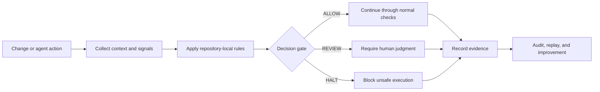

# AI Governance for Developer Tooling

## Positioning

I design governed AI and developer workflows that turn ambiguous automation into controlled, inspectable execution. The focus is practical: deterministic routing, explicit permissions, evidence before enforcement, audit-ready records, and clear human-review boundaries.

This brief consolidates existing portfolio evidence. It does not combine the underlying projects into one product, change their ownership boundaries, or claim production readiness beyond published validation.

## Capability map

| Capability | Existing artifact | What the evidence supports |
|---|---|---|
| Pull-request risk routing | [DiffWall](https://github.com/dburt-proex/diffwall) | Repository-local rules can classify controlled changes into `REVIEW` and `HALT` paths. |
| Evidence before enforcement | [DiffWall live validation](https://github.com/dburt-proex/diffwall/blob/main/docs/live-validation-case-study.md) | Reports, PR comments, and workflow artifacts were published before a destructive change was blocked. |
| Deterministic scoring | [VIL deterministic scoring engine](https://github.com/dburt-proex/VIL_deterministic_scoring_engine) | The current repository documents a FastAPI scoring service, deterministic evidence cap, route thresholds, JSONL audit ledger, metrics endpoints, Docker support, and a pytest test command. |
| Workflow governance patterns | [Governance Harness Toolkit](https://github.com/dburt-proex/governance-harness-toolkit) | The default branch currently exposes only a minimal README; the governed workflow registry and five regression cases remain active work in draft PR #9. |
| Governance assessment | [Operator Intelligence](https://github.com/dburt-proex/operator-intelligence) | The repository documents a v0.1 foundation for evidence-backed assessment, scoring, findings, implementation packages, and a sequenced roadmap. |
| Instruction control | [PromptBP](https://github.com/dburt-proex/PromptBP) | The repository documents versioned schemas, capability contracts, workflow definitions, evaluation fixtures, scoring, bounded recursion, and traceable state objects. |

## Governed development lifecycle

## Verified implementation proof

DiffWall was validated through two controlled GitHub pull-request workflows on July 11, 2026:

1. A governance-sensitive workflow change was routed to `REVIEW` with a score of `48 / 100`.
2. A destructive SQL migration was routed to `HALT` with a score of `100 / 100`.
3. The system generated reports, maintained a marked PR comment, uploaded evidence artifacts, and published evidence before the blocking workflow failed.
4. The proof also preserved independent green CI for the TypeScript and Python engines.

Source: [DiffWall Live Validation Case Study](https://github.com/dburt-proex/diffwall/blob/main/docs/live-validation-case-study.md)

## Repository-verified maturity appendix

Status classifications below reflect the repositories inspected on July 18, 2026. Default-branch documentation is treated as authoritative for merged capability; open pull requests are identified separately as active review work.

| Project | Classification | Verified current evidence | Boundary |
|---|---|---|---|
| [DiffWall](https://github.com/dburt-proex/diffwall) | **Validated early working implementation** | The default branch documents implemented TypeScript PR scanning, Python action validation, composite GitHub Action execution, PR comments, CI evidence paths, GitLab CI guidance, deterministic `ALLOW` / `REVIEW` / `HALT` routing, and CODEOWNERS-aware reviewer suggestions. The live case study provides controlled REVIEW and HALT evidence. | The repository explicitly states it is not yet a fully hardened enterprise DevSecOps product. Django policy-pack work and additional unsafe GitHub Actions detector fixtures remain open in PRs #23 and #24 and are not represented here as merged capability. |
| [VIL deterministic scoring engine](https://github.com/dburt-proex/VIL_deterministic_scoring_engine) | **Documented runnable implementation** | The default branch documents a FastAPI application, deterministic scoring invariant, five routing outcomes, browser dashboard, JSONL audit ledger, API endpoints, Docker startup, and pytest verification command. | Authentication, tenant isolation, configurable policy administration, exportable reports, and database-backed persistence are listed as commercial hardening work. Draft PR #2 changes documentation and operating configuration, not runtime behavior. |
| [Operator Intelligence](https://github.com/dburt-proex/operator-intelligence) | **Documented framework, v0.1 foundation** | The default branch defines an evidence-traceable business growth systems assessment, governed findings, multiple scoring outputs, implementation packages, templates, playbooks, and a sequenced 90-day roadmap. | This is a consulting-methodology foundation. The README does not claim a production software runtime. |
| [PromptBP](https://github.com/dburt-proex/PromptBP) | **Documented execution architecture with schemas and fixtures** | The default branch lists canonical prompt and state schemas, capability contracts, a capability registry, reference workflows, scoring architecture, bounded recursion policy, evaluation fixtures, operations guidance, and traceable state objects. | Repository documentation establishes architecture and control artifacts; it should not be described as a deployed multi-tenant execution platform without separate runtime evidence. |
| [Governance Harness Toolkit](https://github.com/dburt-proex/governance-harness-toolkit) | **Minimal default branch; tested work in active review** | The current default-branch README contains only the repository title. Draft PR #9 describes a governed workflow registry, strict schema validation, deterministic routing, and five passing regression cases. | All PR #9 behavior remains pending human review and must not be represented as merged or released. |

### Evidence interpretation rules

- **Validated implementation** means a repository contains inspectable implementation evidence and a documented validation path; it does not automatically mean enterprise production readiness.
- **Documented runnable implementation** means the default branch publishes concrete startup, API, persistence, and test instructions, but the run was not independently reproduced during this documentation-only portfolio increment.
- **Documented framework** means the repository provides defined methods, schemas, standards, or artifacts without a claim of deployed runtime software.
- **Active review** means the evidence exists on an open pull-request branch and is excluded from merged-capability claims until human approval and merge.

## What this demonstrates

- Governance logic can be encoded into a developer workflow rather than left as prose.
- Risky changes can be separated into explicit `ALLOW`, `REVIEW`, and `HALT` routes.
- Enforcement can preserve inspectable evidence before execution is stopped.
- Independent systems can contribute assessment, scoring, workflow controls, instruction architecture, and enforcement without being collapsed into one repository.

## Current limits

The published DiffWall validation does **not** establish full enterprise production readiness. Release pinning, broader compatibility testing, supply-chain review, large-diff performance testing, and long-term evidence retention remain relevant hardening areas. The default branch now documents CODEOWNERS-aware routing and GitLab CI guidance, so those items are no longer presented here as absent capabilities.

The other projects listed above remain independent systems at different maturity levels. Their current repository documentation, tests, and open pull requests are the source of truth for implementation status.

## Role and buyer relevance

This work is most directly relevant to:

- AI governance engineering
- developer tooling and AI security
- governance automation
- agent authorization and execution controls
- policy-as-code and deterministic routing
- audit and evidence systems
- technical governance architecture
- workflow automation and solutions engineering

## Review path

Use this brief as a map to inspect the canonical repositories and their evidence. Any employer-specific claim, deployment claim, production-readiness claim, or cross-project platform claim should be validated separately before publication or submission.
